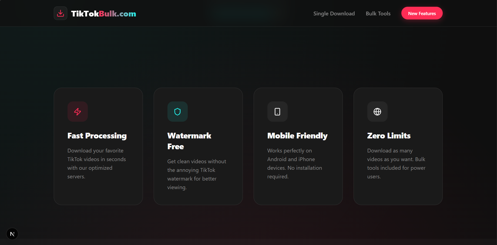

# 🚀 TikTokBulk.com - Professional TikTok Video Downloader

TikTokBulk.com is a state-of-the-art web application designed for creators and marketers who need a fast, reliable, and premium experience for downloading TikTok videos. Built with **Next.js 14**, **Framer Motion**, and **TypeScript**, it offers a seamless interface and powerful bulk processing capabilities.


## ✨ Key Features

- **⚡ Single Video Download**: Paste any TikTok URL and get high-quality download links instantly.
- **📦 Advanced Bulk Downloader**: Process multiple links simultaneously. No more one-by-one waiting.
- **📁 Flexible Export Options**:
  - **ZIP Archive**: Bundle all your processed videos into a single compressed file.
  - **Individual Automatic**: Automatically download each video as a separate file.
- **💎 Premium UI/UX**: Dark mode by default, smooth animations, and responsive design for all devices.
- **🛠️ Smart Proxy System**: Custom-built server-side proxy to bypass CORS and ensure 100% download reliability.
- **🚫 No Watermark**: Automatically fetches the cleanest version of the video available.

## 📸 Screenshots

### Bulk Processing System


### Our Services


## 🛠️ Technology Stack

- **Framework**: [Next.js](https://nextjs.org/) (App Router)
- **Animation**: [Framer Motion](https://www.framer.com/motion/)
- **Icons**: [Lucide React](https://lucide.dev/)
- **Compression**: [JSZip](https://stuk.github.io/jszip/)
- **File Handling**: [FileSaver.js](https://github.com/eligrey/FileSaver.js/)
- **Styling**: Modern Vanilla CSS with CSS Modules

## 🚀 Getting Started

### Prerequisites

- Node.js 18.x or higher
- npm or yarn

### Installation

1. **Clone the repository**
   ```bash
   git clone https://github.com/TharinduNuwantha/tiktokbulk.com.git
   cd tiktokbulk.com
   ```

2. **Install dependencies**
   ```bash
   npm install
   ```

3. **Run the development server**
   ```bash
   npm run dev
   ```

4. **Build for production**
   ```bash
   npm run build
   npm start
   ```

## 🔒 Security & Privacy

We do not store any downloaded videos on our servers. All processing is done via stream-through proxy or directly on the client-side to ensure maximum privacy for our users.

## 👨‍💻 About the Developer


---

Built with ❤️ by [Tharindu Nuwantha](https://github.com/TharinduNuwantha)
